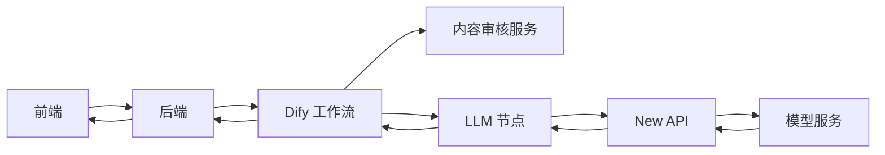
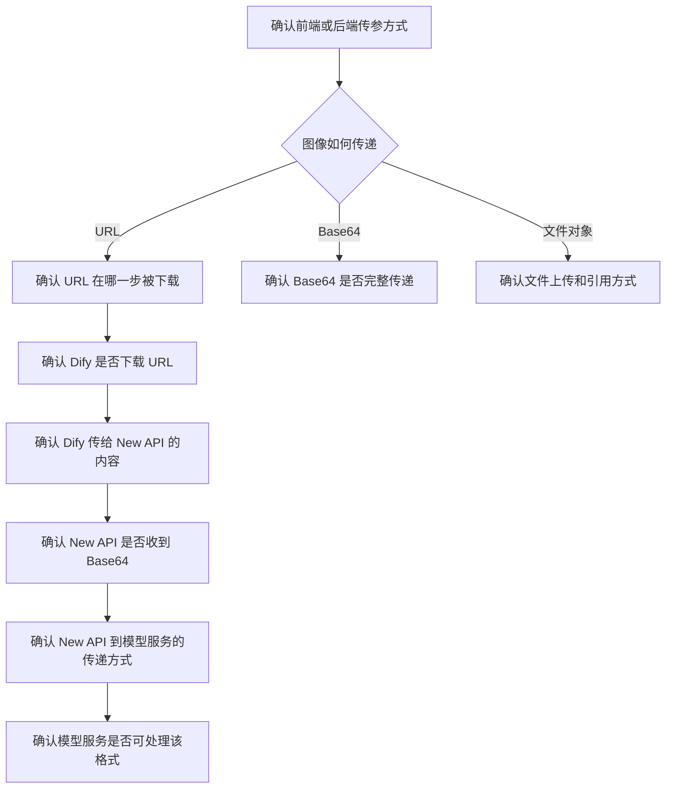

## 1. 背景

本次排查对象是部署在甲方局域网内的一套私有化服务。该环境无外部互联网连接，系统由多个服务共同组成：

- 前端服务：由第三方公司开发和维护。
- 后端服务：由第三方公司开发和维护。
- Dify：由我方部署，负责工作流编排和业务逻辑执行。
- 内容审核服务：由我方部署，供 Dify 工作流调用，用于审核用户输入和模型响应。
- New API：由我方部署，作为统一模型服务入口。
- 模型服务：由甲方提供，作为最终的大模型推理服务。

故障现象由前后端开发公司反馈：调用多模态能力时，带图像的请求没有得到正确返回。

## 2. 系统调用链路

正常业务链路如下：

多模态请求中，图像数据可能以 URL、Base64 或文件对象等形式传递。不同传递方式会影响后续服务的处理逻辑，因此排查的第一步是确认图像数据在整个链路中的真实形态。

## 3. 问题影响

该问题影响带图像输入的多模态请求。可能表现为：

- Dify 工作流未继续执行。
- LLM 节点调用失败。
- New API 收到的请求中缺少图像内容。
- 模型服务无法获取图像文件。
- 模型服务返回异常或非预期结果。

由于链路中包含内容审核、Dify 文件下载、New API 转发、SSRF 防护和模型服务访问等多个环节，不能只从最终报错判断问题来源。

## 4. 排查思路

本次排查按“确认输入形态、确认链路转换、确认服务边界、确认安全策略”的顺序进行。

### 4.1 确认请求参数

首先需要确认前端或后端实际传给 Dify 的请求参数，重点关注图像字段：

- 图像是 URL、Base64，还是通过文件上传后再引用。
- URL 是否为局域网地址。
- URL 是否需要鉴权。
- URL 是否只能从特定服务访问。
- 请求中是否包含正确的文件类型、MIME 类型和字段名。

经确认，第三方开发者传递的是图像 URL。

### 4.2 确认 URL 在链路中的处理位置

确认图像以 URL 形式传入后，下一步要明确：哪个服务负责根据 URL 下载实际图像文件。

需要重点确认：

- 后端是否下载图像后再传给 Dify。
- Dify 是否自动下载 URL。
- New API 是否会下载 URL。
- 模型服务是否支持直接接收 URL 并自行下载。

本次排查中确认：Dify 会自动下载 URL，并将图像内容以 Base64 形式传递给 New API。

### 4.3 确认 Dify 到 New API 的请求内容

在 Dify 已经完成 URL 下载的前提下，需要继续确认 Dify 传给 New API 的请求是否符合预期。

检查重点包括：

- New API 是否实际收到了图像 Base64 数据。
- Base64 内容是否为空或被截断。
- 请求结构是否符合 New API 兼容的模型接口格式。
- 文本内容和图像内容是否在同一个 message 中正确组织。
- 请求日志中是否存在参数过滤、字段丢失或格式转换异常。

本次排查中确认：New API 确实拿到了 Base64 图像数据。

### 4.4 确认内容审核服务状态

内容审核服务是 Dify 工作流中的前置环节，会先对用户输入进行审核。如果内容审核服务异常，Dify 工作流可能不会继续执行后续 LLM 节点。

因此，即使问题表现为“模型没有正确返回”，也需要确认审核服务是否正常。

检查重点包括：

- 内容审核服务是否可访问。
- 审核接口是否返回正常结果。
- 审核服务是否支持当前输入格式。
- Dify 工作流是否因为审核失败或审核异常而提前终止。
- 审核服务日志中是否有请求超时、解析失败或返回码异常。

该检查用于排除工作流未进入 LLM 节点的情况。

### 4.5 确认 New API 到模型服务的传递方式

New API 作为统一模型入口，可能存在不同的图像处理策略：

- 收到 URL 后，下载文件并转换为 Base64，再传给模型服务。
- 收到 URL 后，直接原样透传给模型服务。
- 收到 Base64 后，直接透传给模型服务。
- 收到 Base64 后，重新封装为模型服务要求的格式。

本次链路中，Dify 已经将 URL 转换为 Base64。仍然建议单独测试 New API 的行为：

- 当下游传入 URL 时，New API 是下载并转换，还是直接透传。
- 当下游传入 Base64 时，New API 是否保持格式不变。
- New API 转发给模型服务的请求体是否符合模型服务接口要求。

此外，还可以绕过 New API 进行对照测试：直接将 URL 传递给模型服务，确认模型服务是否能正确下载和处理图像。

该对照测试可以判断问题是在 New API 转发层，还是在模型服务自身的图像获取能力。

## 5. SSRF 防护相关检查

由于图像通过 URL 传递，链路中任何负责下载 URL 的服务都可能受到 SSRF 防护策略影响。

### 5.1 Dify SSRF Proxy

Dify 默认使用 `ssrf_proxy` 服务代理相关外部请求，用于降低 SSRF 攻击风险。

需要检查：

- 图像 URL 是否可以被 Dify 所在容器或服务访问。
- 图像 URL 是否被 `ssrf_proxy` 拦截。
- URL 所在 IP、域名或端口是否在允许范围内。
- Dify 日志和 `ssrf_proxy` 日志中是否有拦截、拒绝或超时记录。

如果图像 URL 是局域网地址，尤其需要确认该地址在 Dify 的 SSRF 策略下是否允许访问。

### 5.2 New API SSRF 保护

New API 也存在默认 SSRF 保护策略。默认情况下，New API 可能禁用局域网请求，并且只允许部分端口访问。

需要检查：

- New API 是否需要访问图像 URL。
- New API 当前是否启用了 SSRF 防护。
- 局域网地址是否被默认策略禁止。
- 图像 URL 使用的端口是否在允许列表内。
- New API 日志中是否存在 SSRF 拦截记录。

如果 New API 只是接收 Dify 传来的 Base64 并转发给模型服务，则 New API 不一定需要访问图像 URL。但如果 New API 在某些场景下会自行下载 URL，则必须检查该策略。

## 6. 建议排查清单

后续遇到类似问题时，可按以下顺序执行：

1. 获取前端或后端发出的原始请求，确认图像字段的传递方式。
2. 如果传递的是 URL，确认 URL 是否在局域网内可访问，是否需要鉴权。
3. 在 Dify 日志中确认是否下载了 URL，以及是否生成了 Base64 数据。
4. 在 New API 日志中确认是否收到了 Base64 图像内容。
5. 检查内容审核服务是否正常，确认工作流是否进入 LLM 节点。
6. 检查 Dify `ssrf_proxy` 是否拦截图像 URL。
7. 检查 New API SSRF 防护是否影响 URL 下载或局域网访问。
8. 单独调用 New API，分别测试 URL 和 Base64 两种输入。
9. 绕过 New API，直接调用模型服务，确认模型服务对 URL 和 Base64 的支持情况。
10. 对比 Dify、New API、模型服务三处请求体，确认图像字段是否在某一环节丢失或被改写。

## 7. 关键判断点

本次问题不能只判断“模型服务返回异常”，而应拆分为以下几个关键判断点：

- 前后端是否传入了正确的图像参数。
- Dify 是否能访问并下载图像 URL。
- Dify 是否正确转换并传递 Base64。
- 内容审核服务是否阻断了工作流。
- New API 是否正确接收并转发图像数据。
- New API 的 SSRF 策略是否影响图像 URL 访问。
- 模型服务是否支持当前图像输入格式。
- 模型服务所在环境是否能访问传入的图像 URL。

只有逐项确认后，才能准确定位问题发生在哪一层。

## 8. 复盘结论

本次排查的核心是确认多模态图像数据在私有化链路中的实际流转方式。前后端传入的是图像 URL，Dify 会负责下载该 URL，并将图像转换为 Base64 后传递给 New API。New API 已确认能够收到 Base64 数据。

因此，后续需要重点关注以下方向：

- Dify 下载 URL 时是否受到 `ssrf_proxy` 策略影响。
- 内容审核服务是否正常，是否在 LLM 节点之前中断工作流。
- New API 转发给模型服务时是否保持了正确的多模态请求格式。
- 模型服务是否支持 New API 转发后的 Base64 图像格式。
- 如果模型服务接收 URL，模型服务自身是否具备访问该 URL 的网络条件。

## 9. 改进建议

为降低后续类似问题的排查成本，建议补充以下能力：

- 在 Dify、内容审核服务、New API 和模型服务之间建立统一的请求追踪 ID。
- 在日志中记录图像输入类型，例如 URL、Base64 或文件引用，但不要记录完整 Base64 内容。
- 为多模态链路增加独立健康检查，包括 URL 输入和 Base64 输入两种场景。
- 明确各服务对图像输入格式的责任边界，避免多个服务重复下载或重复转换。
- 固化私有化环境中的 SSRF 白名单、端口白名单和局域网访问策略。
- 提供一组标准测试样例，用于验证前端、后端、Dify、New API 和模型服务的端到端行为。

通过以上改进，可以在后续交付和运维中更快判断问题来源，减少跨团队沟通成本。
